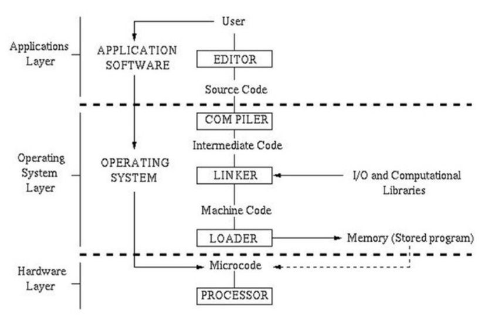
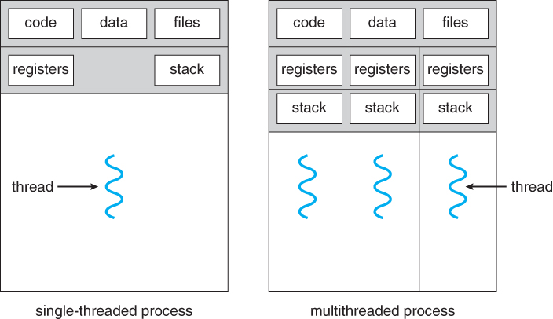
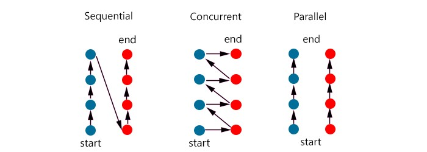
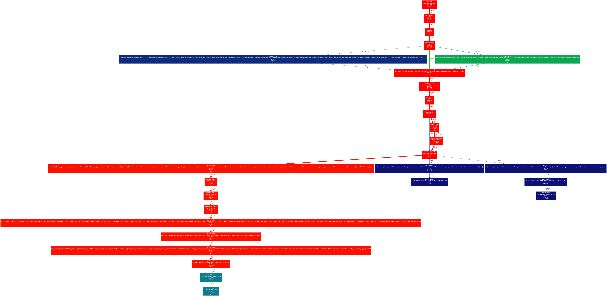
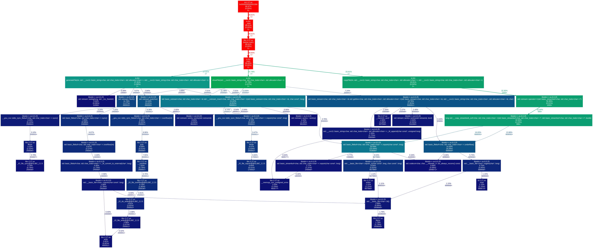
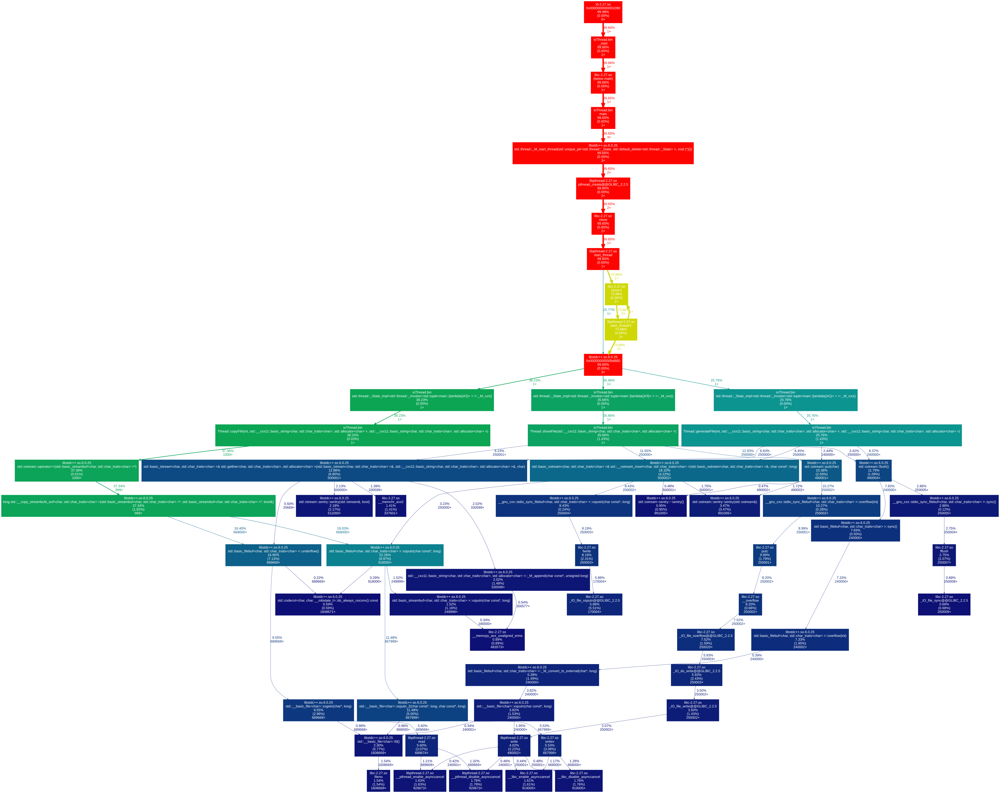

### Introduction

- What's the difference between program, process and thread

A program is nothing more than machine code that was translated from a low, medium or high level language:

A process is an instance of the machine code that is being executed, along with its dependencies, e.g dynamic or static libraries. Normally a process has only one thread of execution, the communication between different processes is done through the OS via interprocess communication, which has a heavy cost.

A thread is a hardware modularization, in the sense that it "has" its own scope: program counter, stack and registers. The heap memory is shared between all the threads (and process context by the threads issued in the same process), that is how different threads communicate, which has a low cost. Multithread programming allow us to have more than one thread per process and parallel execution.

In theory threads and processes are the same, what differ them is the context and some minor rules.

- What's the difference between concurrent and sequential programming

The difference between concurrent and sequential programming is that the sequence is order-dependent and concurrent can alter between different contexts to give each context a processing time. The parallel programming executes different contexts at the same time and can also be concurrent or sequential.

- What's the difference between CPU, I/O and Memory bound

The difference between CPU, I/O and Memory bound is that each one limits the process in a certain way, e.g CPU bound is when the CPU realizes a huge amount of calculations in a small amount of numbers, I/O bound is when a lot of read and write operations are realized in disk and Memory bound is similar to CPU bound, but a huge amount of numbers is used to calculate.

- Concurrent programming in C++

C++ has lots of libraries that help us to build concurrent programs, e.g we have `<thread>` to create threads and manage them, besides get information about the hardware, `<mutex>` that allows mutual exclusion (mutex) of concurrent execution of critical sections of code, allowing to explicitly avoid race conditions, `<atomic>` that has types that encapsulate a value whose access is guaranteed to not cause data races and can synchronize between different threads, `<chrono>` that gives a powerful time management like clock, time point, duration, etc; `<functional>` that offers functional objects to facilitate usage of threads, `<async>` that allows asynchronous programing, between other libraries.

### Planing

The experiments were planned the following way:

- CPU: create, sort and show a vector of random numbers

- I/O: create, copy and show files

For each experiment a version with thread and without thread was created. To evaluate the change between the version sequential and the concurrent version, the time was clocked and the dynamic memory was analyzed via Valgrind and Gprof 2 Dot.

### Development

- Hardware

Memory: 8GB

CPU: Intel i5-8250U (8) @ 3.400GHz

GPU: NVIDIA GeForce MX150

GPU: Intel Integrated Graphics

### Results

The choice of where to apply the concurrency was based on the operations that can change the context, e.g generate a vector of random numbers and print each time a new number is generated, but not in the sort algorithm that depends on the previous steps to perform a future or present processing.

- CPU

Generating 10000 numbers between 0 and 10000 and showing in the console, it had executed in 1082258 microseconds. The ecution graph.

- CPU Thread

Generating 10000 numbers between 0 and 10000 and showing in the console, it had executed in 1171224 microseconds. The ecution graph.

- I/O

Generating 10000 files, copying 1000 files and showing 1000 files in the console, it had executed in 19519808 microseconds. The ecution graph.

- I/O Thread

Generating 10000 files, copying 1000 files and showing 1000 files in the console, it had executed in 18800154 microseconds. The ecution graph.

### Conclusion

Threads can grant a faster execution and a better resource usage, but brings a complexity that can cause memory leaks and a complex debugging.

While in the sequential programming the default OS stack is used, when separate stacks are added to the game the resource share and instruction shows really trick, so to apply thread concepts it is needed to synchronize the resources and data to don't cause races or deadlocks.
